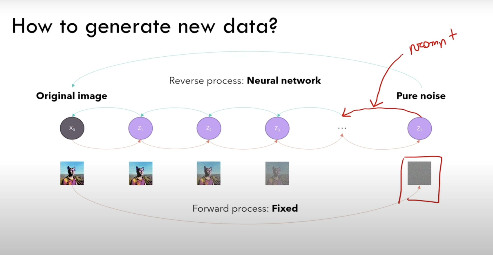

# stable diffusion 

we are creating joint distribution model. 

### forward process of sd 
The idea in forward process is given a input image we need to create a noisified version of image in each timestep using standard deviation(which adds Noise). 

    Input image(i) --> Noisified version(1) of Input image(v1) --> Noisified version(2) of v2 
what distingushes diffusion models from other types of latent variable models is the approximate posterior called forward process or diffusion process, is fixed to markov chain that gradually adds Gaussian Noise according to variance schedule, $\beta_0$,$\beta_1$,...	

### reverse process of sd 

in reverse process, we try to denoise the image given an noisy image. we try to marganlize better weith Evidence Lower Bound(**ELBO**) 

