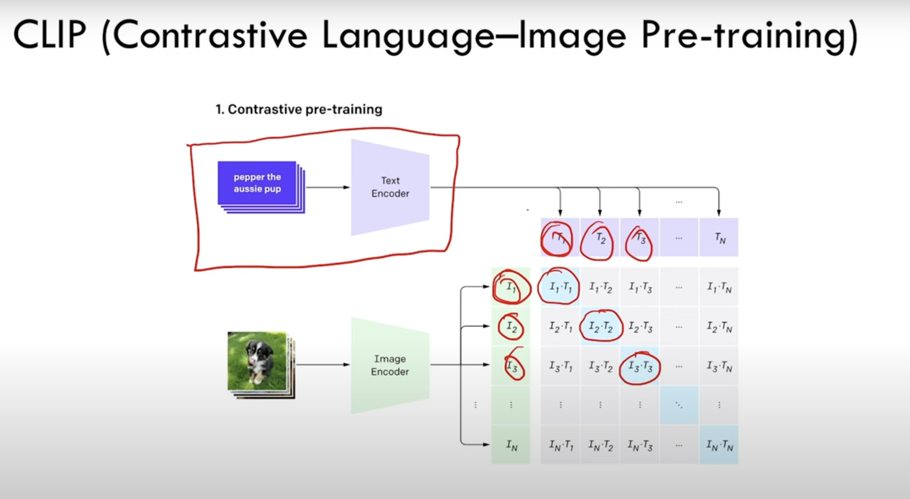

# stable diffusion 

we are creating joint distribution model. stable difrfusion is latent diffusion model. we dont learn the distubtion p(x) of our dataset of images, rather the distirbution of latent represenetation of data using *Vartional autoencoder*

### forward process of sd 
The idea in forward process is given a input image we need to create a noisified version of image in each timestep using standard deviation(which adds Noise). 

    Input image(i) --> Noisified version(1) of Input image(v1) --> Noisified version(2) of v2 

what distingushes diffusion models from other types of latent variable models is the approximate posterior called forward process or diffusion process, is fixed to markov chain that gradually adds Gaussian Noise according to variance schedule, $\beta_0$,$\beta_1$,...	

###  reverse process of sd 

in reverse process, we try to denoise the image given an noisy image. we try to marganlize better weith Evidence Lower Bound(**ELBO**) 

we modifify the unet to find the joint distribution P(x,c) 

we input 
- input image 
- timestamp -> mentioning the noise level( the maximum value of timestamp t0 indicates more noise)
- prompt telling to geenerate a dog ( skipped in step2)

in step2 we feed the same input skipping the prompt, making sure the model can generate image similar to the step1, then we combine output1 and output2 to see how closer we want output2 to be similar to output1.This process is called classifier free guidance 

output = w *(output conditioned - outputunconditioned) + outputunconditioned

w - weight indicates how much we can t model to pay attention top conditioning singal(prompt)

contrastive Language Image Pre-training(**CLIP**)

we use clip encoder to convert textual prompts to embeddings. we train model to have higher value only along diagonal and lesser value in other cells. Each image is associated with the corresponding textual prompt this way T1 -> I1, T2->I2. we take this textual embeddings and use as conditional embedding in our U-Net model  

rather than a high quality images like 512*512 image we compress the image using Varational Auto-Encoder to approx. 64\*64 using VAE . 
